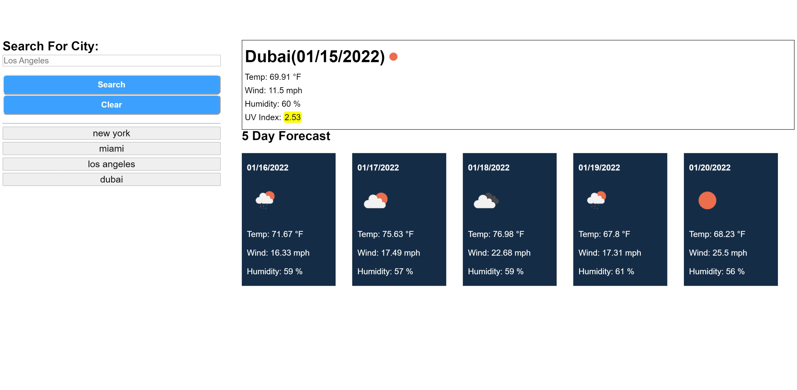

<<<<<<< HEAD
  
  # Weather Forecast
  ## Description
=======
The application is deployed here: https://adolfo-g.github.io/Weather-Forecast/
>>>>>>> 9bdaf45d3a44d0d0a0e70a6c222f49b6a42bc1c5

  - Motivation
    This app functions to provide a user with a five day forecast for a given users city.

  - Functionality
    By searching the name of a city, weather data for the day as well as the five day forecast will appear. the user also has the option of looking at their search history and reselecting a previous search. This application uses OpenWeatherMap API

    

  ## Table of Contents
  * [Installation](#installation)
  * [License](#license)
  * [Questions](#questions)

  ## Installation
  The deployed application can be accessed here: https://adolfo-g.github.io/AG-Homework-6/
 
  ## License
 
  https://opensource.org/licenses/MIT
  
  ## Questions
  -For any questions or concerns please reach out to me at
    github:  https://github.com/Adolfo-g
    email:  adolfog5545@gmail.com
    